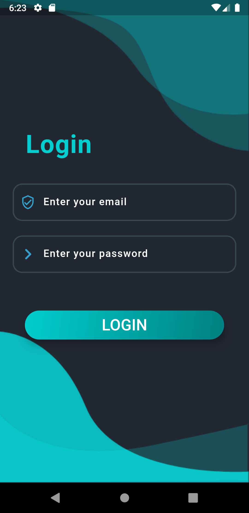
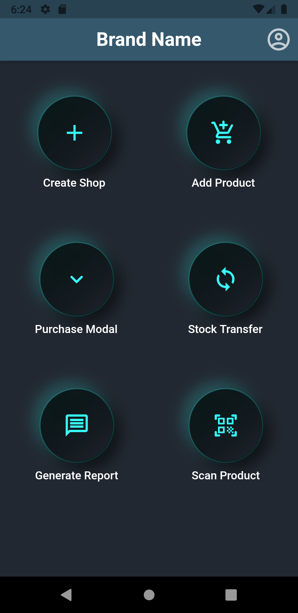
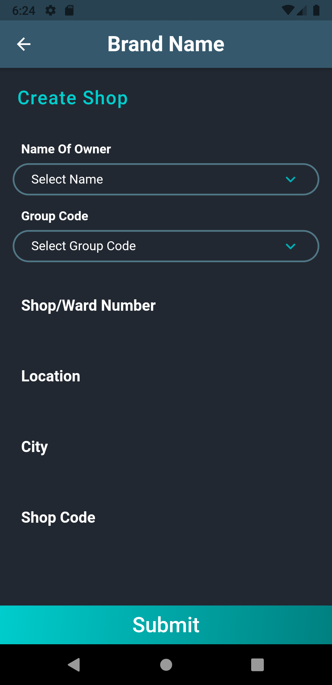
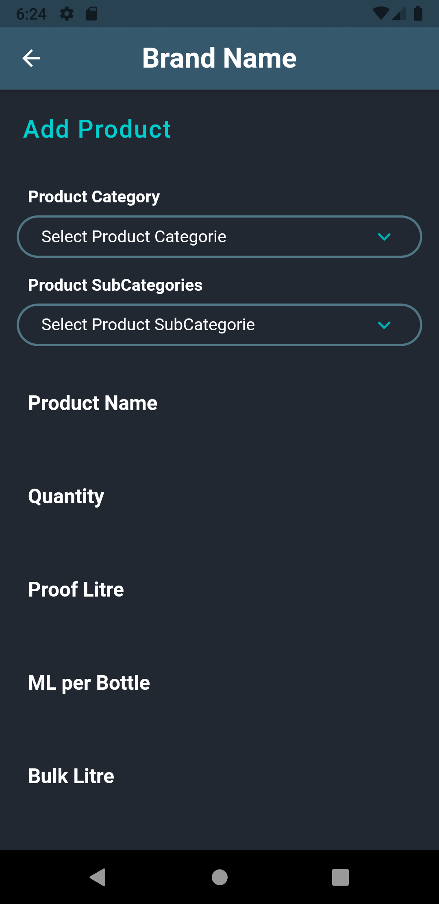
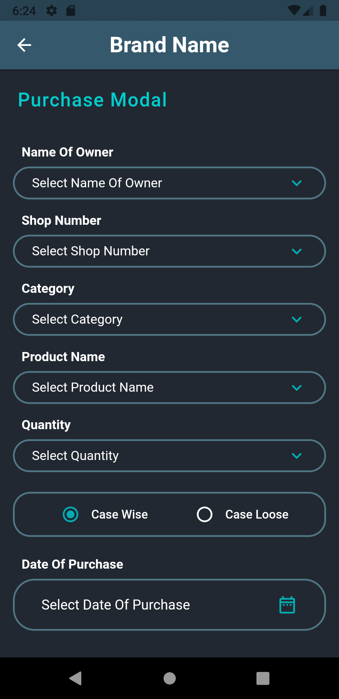
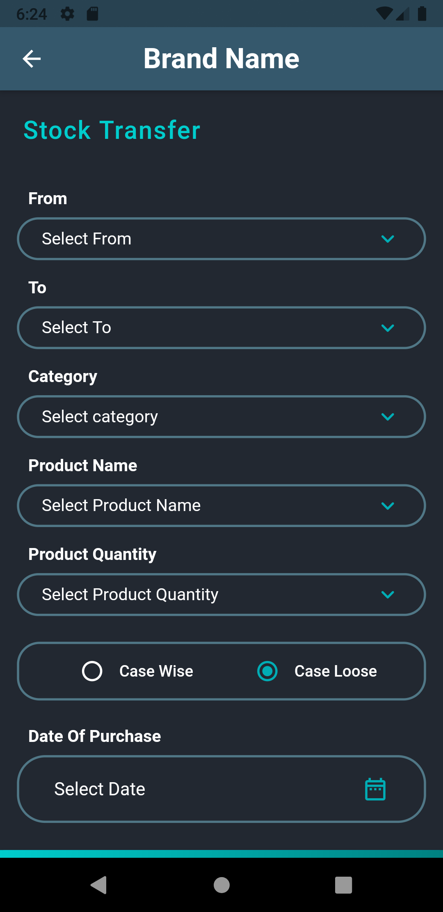
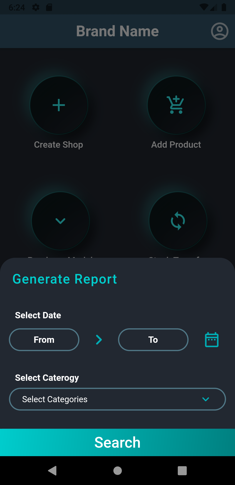
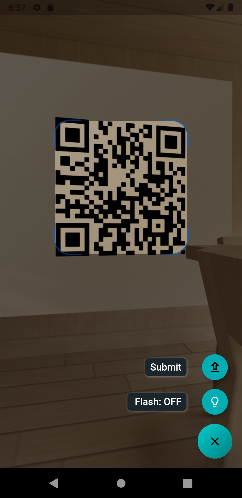

# LocalStore shopping_cart:

In this app the local shop owner can create their account and upload the product details with quantity so that customer can buy their showcased products. Their is also an inbuild Barcode scanner if a customer came directly to their shop for purchasing, then by scanning that product update the quantity of products online also.

## ScreenShot :framed_picture:

